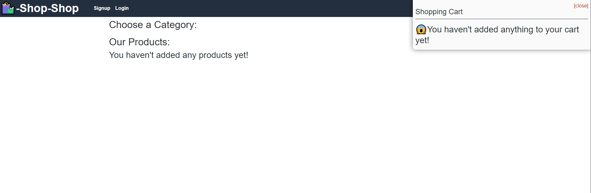

# Title
* Redux Shop

#Tech used
*Used Redux to refactor from the old storeContext that was used before for state management

# Functionality

*The deployed link right now is unable to show products for whatever reason its not even giving me an error for it.
so i have included a video showing that you can browse products and add them to your cart and the state is all through redux.

# how to use it for yourself

*clone the repo to a file and make sure to npm i in all the folders (root, client, and server) then run this command npm run develop 
and be amazed 

deployed link: https://blooming-hollows-73733.herokuapp.com/
